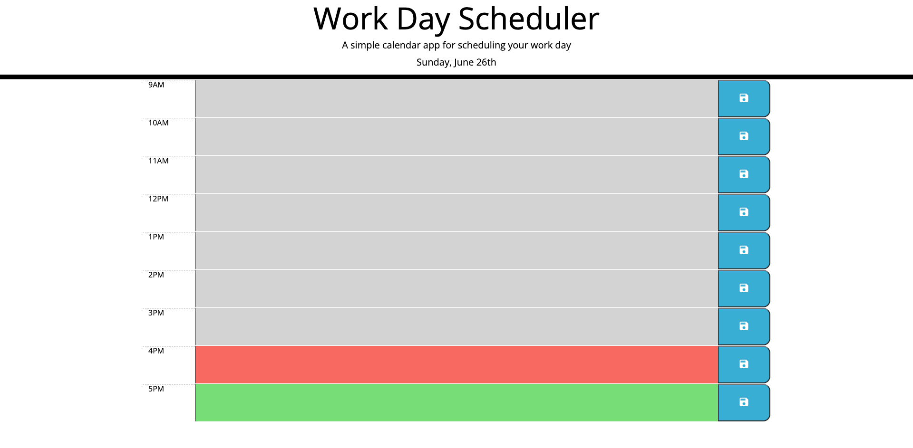
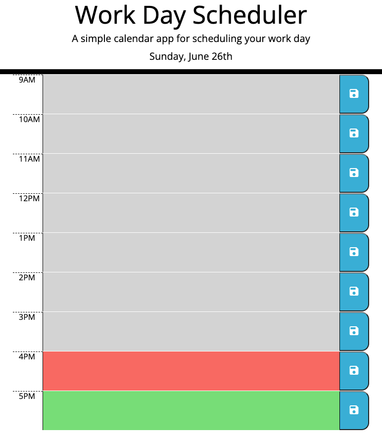

# work-day-scheduler

## Description

This is a simple calendar application that allows a user to save events for each hour of the day. The color codes represent grey, red and green respectively. Grey means past event while green means future events. Red indicates the current hour which will move accordingly to real time. 

# Run the website

You can open the website by clicking here.
https://dark40.github.io/work-day-scheduler/

## Screenshots

